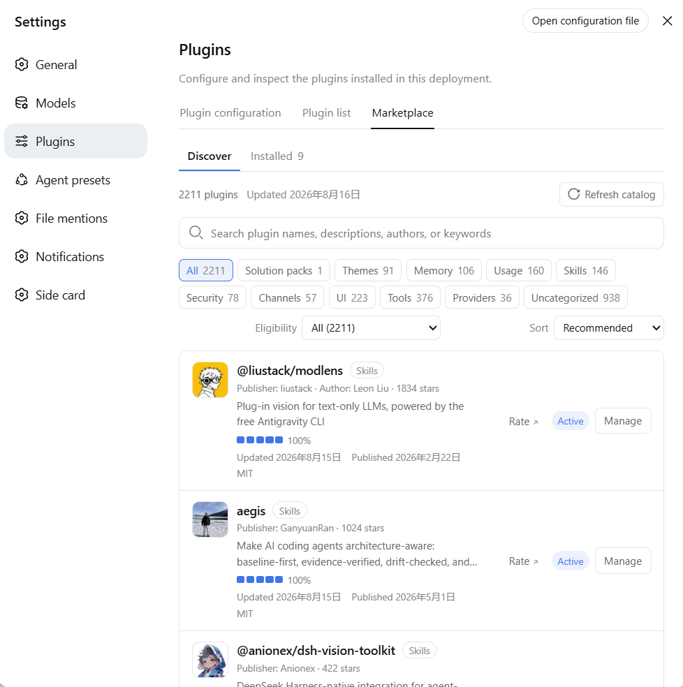
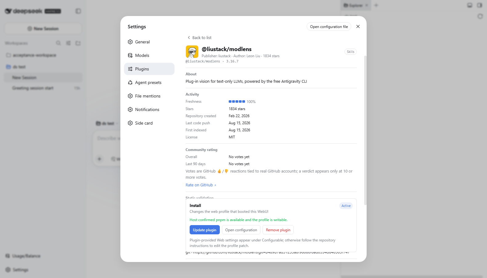
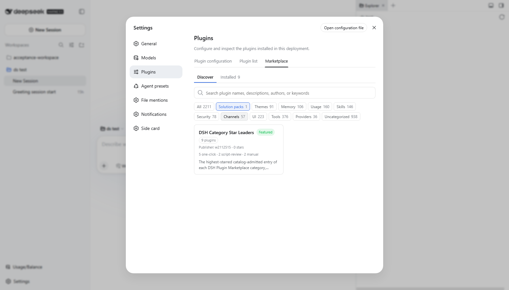
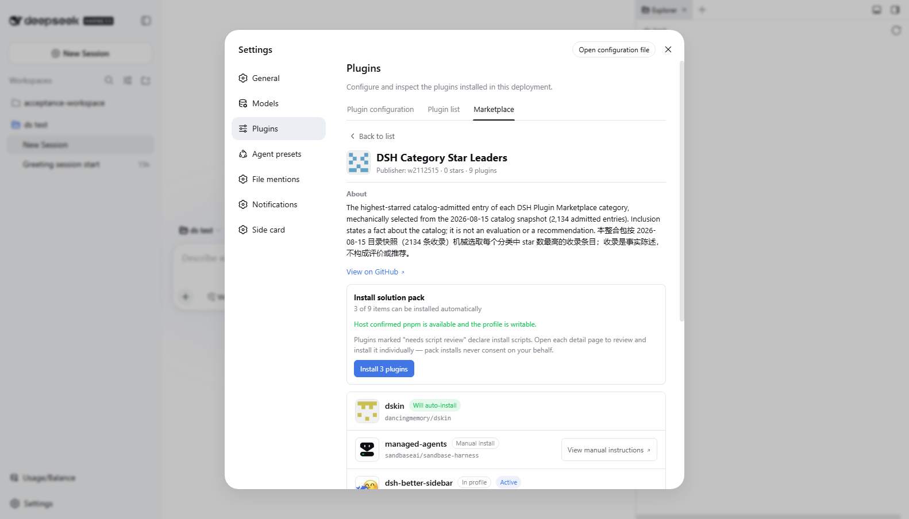

# DSH Plugin Marketplace

**The plugin marketplace for [DeepSeek Harness](https://github.com/deepseek-ai/deepseek-harness) (DSH): browse, review, and install DSH plugins from inside DSH's own Settings UI — with evidence-based install safety, consent-gated install scripts, curated solution packs, and zero telemetry.**

**中文文档：[README.zh-CN.md](README.zh-CN.md)**（界面语言跟随 DSH 自动切换）

## What is DSH Plugin Marketplace?

DSH Plugin Marketplace is an **out-of-tree, installable DSH bundle** that adds a full plugin marketplace to DeepSeek Harness. It is not part of the official DSH repository, requires no changes to DSH source code, and is not a standalone web product. Once installed into the `web` profile, DSH's Host Loader mounts the marketplace Host plugin, and the package's declared `dsh.client` browser entry registers itself under `Settings → Plugins → Marketplace`. The UI is bilingual and follows DSH's display language automatically (中文 / English).

At a glance:

- **2,200+ plugins** discovered by a daily scan of every GitHub repository carrying the `dsh-plugin` topic — no GitHub account or token needed to browse.
- **Evidence-based install eligibility**: the scanner proves which install targets exist at each plugin's pinned commit, so "one-click" means *proven installable*, not *probably fine*.
- **Consent-gated scripts**: install scripts are shown verbatim and run only after explicit, per-install consent — never persisted, never bulk-approved.
- **Curated solution packs** that install a coherent capability baseline in one reviewed action.
- **No telemetry, no install counts, no server** — the catalog is static JSON on GitHub Pages.



## Install into your DSH

From npm:

```powershell
dsh plugin --profile web add @w2112515/dsh-plugin-marketplace
```

Or pin an immutable commit from GitHub (this repository commits its built `lib/`, so no `prepare` runs on your machine):

```powershell
dsh plugin --profile web add github:w2112515/dsh-plugin-marketplace#<40-char-commit>
```

Regular users need no GitHub token. Automatic installs require the Host to run `pnpm` 11 (the plugin also tries `corepack pnpm`); consent-gated script installs require pnpm ≥ 11.7. When no package manager exists, the WebUI keeps browsing and shows a recovery hint instead of a fake success. Uninstall: `dsh plugin --profile web remove @w2112515/dsh-plugin-marketplace`.

The default catalog is served from this repository's GitHub Pages. During development you can override it:

```powershell
$env:DSH_PLUGIN_MARKETPLACE_CATALOG_URL = 'https://w2112515.github.io/dsh-plugin-marketplace/plugin-marketplace/catalog-v1.json'
dsh plugin --profile web add D:\Work\dsh-plugin-marketplace
dsh --profile web --dump-config
dsh web
```

## Install safety

Automatic installs pin an immutable 40-character commit and always go through capability preflight → short-lived review plan → confirmed execution, with rollback of the profile manifest, lockfile, and workspace config on failure. Eligibility is decided by evidence at the pinned commit:

| Catalog entry | What the scanner proved | What happens on install |
| --- | --- | --- |
| **Automatic install** | Every install target (entry files, patch) exists in the pinned commit's git tree | `pnpm add --ignore-scripts` — third-party lifecycle scripts never run |
| **Needs script review** | Targets are absent (build output not shipped), but the package declares lifecycle scripts | Scripts are shown **verbatim** in the review step; after your explicit consent, the Host installs once with `--allow-build=<name>` instead of `--ignore-scripts`, scoping script execution to exactly the reviewed package within that single invocation. Nothing is written to `allowBuilds`; consent is never persisted |
| **Manual install** | Neither of the above | Repository link only; the marketplace never runs anything |



## Solution packs

A pack is a curated list of plugin repositories — nothing more. A repository becomes a pack by carrying **both** the `dsh-plugin` and `dsh-plugin-pack` topics plus a `dsh.pack.json` manifest:

```json
{
  "schemaVersion": 1,
  "name": "My Essentials",
  "description": "A curated starter set",
  "items": ["owner/plugin-a", "owner/plugin-b"]
}
```

- `items` holds 1–50 `owner/repo` strings; resolution to stable repository ids happens at scan time against the catalog itself, so renames never rewrite identity silently.
- The marketplace shows every item's explicit status — *will auto-install*, *needs script review*, *manual install*, *not in catalog*, *already installed* — and an honest `install N of M` count. Pack cards also disclose the install composition up front (`7 one-click · 1 script-review · 1 manual`), computed from catalog truth at scan time.
- Installing a pack runs the normal single-plugin plan→execute path serially, stops at the first failure, rolls nothing back, and reports each item's outcome.
- **Packs grant no privilege**: script-gated items still require their own per-plugin review and consent; manual items stay manual.
- **Packs are never ranked by stars.** Star ranking would reward stuffing a pack with the most-starred plugins — a star-sorted category view in disguise, not curation. Order is editorial first (packs reviewed by the marketplace maintainers for coherence and honesty, listed in `FEATURED_MARKETPLACE_PACKS`), then freshness. Curation follows 宁缺毋滥 (*quality over quantity*): a missing capability slot stays empty rather than being filled with an unproven plugin.





## Community ratings

Ratings borrow GitHub's native reactions: every catalog plugin gets a ballot comment under the [ratings issue](https://github.com/w2112515/dsh-plugin-marketplace/issues/1), and a 👍/👎 reaction on it is a vote — one vote per real GitHub account. Detail pages show an overall window plus a trailing 90-day window, and **no verdict appears below 10 votes**. The client is read-only; voting itself happens entirely on GitHub, so the marketplace never holds your credentials.

## For agents

The marketplace is agent-native: the Host plugin registers four tools the DSH agent can call in any session — `marketplace_search`, `marketplace_detail`, `marketplace_install`, and `marketplace_manual_guide`. Search and detail are read-only. Installs run the **same** plan→execute pipeline as the WebUI, and every call asks for one-time human approval with the plugin name, pinned commit, and risk signals in the prompt — consent is never persisted and never bulk-granted. Script-gated entries are refused by design (verbatim script review stays in Settings → Plugins → Marketplace); manual entries are never executed by the marketplace — the guide tool fetches the repository's own install instructions for the agent to follow with its ordinary shell tools. Plugins activate after a `dsh web` restart. Set `agentTools: false` in the bundle config to disable the agent surface.

An agent can also install the marketplace itself with its ordinary shell tool:

```powershell
dsh plugin --profile web add github:w2112515/dsh-plugin-marketplace#<40-char-commit>
dsh --profile web --dump-config   # verify the bundle layer
# restart dsh web to activate
```

## Privacy stance

The marketplace is **read-only against a static catalog and never phones home**: no install counts, no telemetry, no analytics endpoint. There is deliberately no server to collect them — the catalog is plain JSON on GitHub Pages, and every install decision happens on your machine. Popularity signals come from GitHub's own public data (stars), nothing else.

## How it works

- **Distribution unit**: one npm/Git/tarball package declaring `dsh.bundle.patch`.
- **Host**: downloads and strictly validates the central static catalog (schema + integrity digest), keeps a last-known-good cache, and owns review and mutation of the current profile.
- **Client**: a `settings.plugins.tab` Slot contribution providing search, category filters, detail pages, risk signals, review confirmation, and solution packs.
- **Host/Client channel**: a package-private, same-origin `/api/plugin-marketplace` JSON API. DSH's static Typert Remote manifest is untouched.
- **Catalog production**: a daily GitHub Actions scan of repositories carrying the `dsh-plugin` topic. Only statically validated, non-archived bundles enter the public catalog; rejects are kept in the workflow artifact. Searches that hit GitHub's 1,000-result cap are bisected by creation-date windows. Only the central scanner uses the repository's own `GITHUB_TOKEN`.
- **Categories**: plugins are classified into nine categories (theme, memory, usage, skill, security, channel, UI, tool, provider) from an explicit `dsh-category-<slug>` topic or conservative whole-word tokens; a plugin with no honest signal stays *uncategorized* rather than being misfiled.

## For plugin authors

To be discoverable, your repository needs the `dsh-plugin` topic, a `package.json` declaring `dsh.bundle.patch`, and a valid `cordis.patch.yml`. An optional `dsh-category-theme|memory|usage|skill|security|channel|ui|tool|provider` topic sets your catalog category explicitly.

**To qualify for automatic install**, the files your bundle loads must exist in the git tree at the pinned commit — commit your built output (e.g. `lib/`), the way this repository does. If built output is intentionally not committed and your `prepare`/`install` scripts produce it, users will see your scripts verbatim and can consent to run them per install; the consent never extends beyond the reviewed commit.

## Configuration

The bundle's patch row id is `plugin-marketplace`. Override the full config in `$DSH_HOME/profiles/web/cordis.patch.yml` (patch `config` is replaced wholesale, not deep-merged — write every field):

```yaml
- id: plugin-marketplace
  config:
    catalogUrl: https://w2112515.github.io/dsh-plugin-marketplace/plugin-marketplace/catalog-v1.json
    maxAgeMs: 172800000
    timeoutMs: 15000
    maxBytes: 5000000
```

## Repository layout

```text
dsh-plugin-marketplace/
├── package.json
├── cordis.patch.yml
├── src/
│   ├── index.ts                 # Host plugin & same-origin API
│   ├── catalog*.ts              # schema, network, LKG cache, queries
│   ├── profile-operations.ts    # plan/confirm/rollback, consent-gated execution
│   └── client/                  # WebUI Slot plugin (zh/en)
├── scripts/                     # GitHub scanner (plugins + packs)
├── website/public/              # workflow-generated static catalog
└── .github/workflows/           # CI and the daily Pages publication
```

## Local development

Requires Node.js `^22.19.0 || >=24` and pnpm 11.

```powershell
cd D:\Work\dsh-plugin-marketplace
pnpm install --frozen-lockfile
pnpm run build
pnpm run check
pnpm pack --dry-run
```

## Non-goals

- No code submissions to, or release demands on, `deepseek-ai/deepseek-harness`.
- No modification of DSH's Web bundle, Settings Slot, API Remote, or CLI sources.
- The browser never talks to the GitHub API directly; users never configure tokens.
- Lifecycle scripts never run without the user's explicit, per-install, per-commit consent.
- No telemetry of any kind — including install counts.

## Links

- [DeepSeek Harness](https://github.com/deepseek-ai/deepseek-harness) — the host project
- [DSH Category Star Leaders](https://github.com/w2112515/dsh-essentials-pack) — a solution pack listing each category's highest-starred catalog entry (mechanical, snapshot-dated)
- [linux.do](https://linux.do) — 新的理想型社区（友链）
