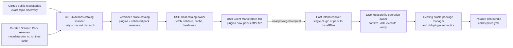

# DSH Plugin Marketplace

> 状态：方案基线已确认，待实现；Solution Packs 已作为 M2.5 演进能力纳入，但不扩大当前 M0/M1 范围。
>
> 本仓库当前只承载可执行的产品与架构规格，不代表功能已经进入 DSH，也不定义未经源码验证的公共 API。

## 结论

DSH Plugin Marketplace 是 **DeepSeek Harness 自身的一组 workspace plugins**，直接随 DSH WebUI 组合和加载；它不是需要用户另外部署、登录或维护的独立产品。

市场中的第三方插件继续使用 DSH 已有的唯一外部分发机制：安装到 profile 的 `dsh.bundle` 包和 `cordis.patch.yml`。市场只负责发现、判断、安装编排和入口展示，不创造 `.dsh-plugin`、第二套仓库缓存或另一种插件运行时。

后续的 **Solution Pack（整合方案）** 是版本化、可审计的安装配方：它引用目录中的独立 bundle，并解析成同一种 profile 安装计划；它本身不是 `dsh.bundle`、不是 `dsh.profile`，也不是会获得额外运行权限的“超级插件”。

MVP 采用零 VPS 架构：

- 项目维护方的 GitHub Actions 每日扫描公开 GitHub 仓库；
- 扫描结果发布为版本化静态目录；
- DSH Host 获取、校验并缓存目录；
- WebUI 只向本机 DSH Host 读取目录，不直接调用 GitHub API；
- 普通用户不需要 GitHub 账号、Token 或额外配置；
- 安装和配置始终在本机 Host 的权限边界内完成。

只有当仓库规模或刷新频率确实超过 GitHub Actions 与 API 限额时，才考虑由项目方配置 GitHub App 或专用凭据。该凭据也不会下放给普通用户。VPS 不是 MVP 的前置条件。

## 产品边界

### 要解决的问题

用户打开 DSH WebUI 后，应能在 **Settings → Plugins → Marketplace** 中：

1. 搜索和筛选可发现的 DSH 插件；
2. 根据用途、兼容性、维护活跃度和风险信号判断插件是否值得尝试；
3. 查看 GitHub stars、仓库创建时间、最近代码更新时间和市场首次收录时间；
4. 在满足安全条件时生成安装计划、确认后安装到指定 profile；
5. 安装后明确看到是否需要重启，以及插件是否提供 WebUI 配置入口。

单插件闭环成立后，用户还应能按“开发协作”“Web 调研”等真实结果发现由多个插件组成的 Solution Pack，审查完整差异后一次确认安装，而不是逐个理解和寻找插件。

### 不做什么

- 不建设独立 SaaS、用户系统或插件商店后端；
- 不要求每位用户配置 GitHub；
- 不让浏览器直接访问 GitHub、运行包管理器或持有安装凭据；
- 不恢复已经移除的 repository Plugin、`.dsh-plugin` 格式或第二套包缓存；
- 不把 topic、stars 或“能安装”描述为安全认证；
- 不在中央扫描任务中执行第三方仓库代码；
- 不在 MVP 中自动重启 DSH；
- 不把 Cordis/Zod 配置结构自动猜测成通用表单；
- 不把多个插件重新发布成一个不透明 bundle，也不让 Pack 绕过现有 profile composition；
- 不在单插件安装闭环成立前开放 Pack 批量安装；
- 不在首期 Pack 中支持嵌套、自动写入 secrets、静默覆盖配置或“一键删除全部成员”。

## 已确认的用户路径

### 1. 浏览

Marketplace 首次打开时从 DSH Host 读取缓存目录。界面显示目录生成时间、数据来源和新鲜度。

- 在线且目录有效：后台刷新，先展示缓存，再替换为新目录；
- 离线但有缓存：展示最后一次成功目录，并明确标注时间；
- 无缓存且刷新失败：展示错误、重试和 GitHub 页面入口；
- 目录过期：仍可浏览，但安装动作进入更严格的重新校验流程；
- 非本机访问：允许浏览，安装、更新、移除和配置写入按钮禁用并解释原因。

### 2. 判断

列表项和详情至少展示：

- 插件名、简述、关键词或 GitHub topics；
- GitHub 仓库、作者和 license；
- stars 快照及快照时间；
- 仓库创建时间；
- 最近代码 push 时间；
- 市场首次收录时间和本次索引时间；
- 是否归档、manifest 是否有效、DSH 兼容性状态；
- 安装来源、固定版本或 commit，以及已知 lifecycle/build script 风险；
- “已发现”“结构有效”“可一键安装”等互不混淆的状态。

GitHub 的 `updated_at` 会被 issue、wiki 等活动改变，因此不作为“插件最后更新时间”。产品中的“最近代码更新”使用 `pushed_at`。

### 3. 安装

安装不是列表按钮触发后直接执行。它必须经过：

1. 选择目标 profile；
2. 本机重新读取最新目录并解析精确来源；
3. 生成安装计划，展示包名、精确版本或 commit、bundle 变化、脚本风险和重启要求；
4. 用户显式确认；
5. Host 在每个 profile 的独占锁内执行异步操作；
6. 只有包管理成功后才提交 bundle/profile 状态并核验结果；
7. 返回 `installed`、`failed`、`cancelled` 或 `recovery-required` 等真实状态。

首期一键安装只面向可固定到精确版本、已有预构建产物、没有安装期 lifecycle script、manifest 有效且兼容性已确认的 npm/tarball 包。

Git 源可能通过 `prepare` 执行代码。此类来源即使被发现，也只能进入高级手动流程，必须固定 commit 并单独提示风险；不能标记为普通“一键安装”。

当前 DSH Web 组合不会因为 profile 新增 bundle 就自动激活它。因此 MVP 的成功文案是“已安装，需要重启 DSH 后启用”，不能伪装成已经运行。

### 4. 配置

Marketplace 不自动把任意插件配置 schema 渲染为表单。

- 插件重启后若通过现有 Settings Slot 提供配置卡片，`Configure` 跳转到该卡片；
- 插件未提供 WebUI 配置时，界面明确显示“暂无应用内配置”，并提供 README 或本地配置文件指引；
- Host 配置暴露仍需显式注册和授权，不能因为插件被市场收录就自动获得读写能力。

### 5. 整合方案（M2.5）

Solution Pack 按用户要完成的结果组织，而不是按 stars 堆叠“热门插件大礼包”。用户从 Marketplace 的“整合方案”范围进入，查看方案目标、维护者、版本、DSH 兼容性、必选与可选插件、聚合风险和更新时间。

安装 Pack 时：

1. 用户选择目标 profile 和可选成员；
2. Host 以当前静态目录快照与本机 profile 状态解析全部成员；
3. UI 展示将新增、保持、冲突、阻塞或需要手动处理的每一项；
4. 任一必选成员不满足 one-click 资格时，整个 Pack 不显示普通一键安装；
5. 用户确认后，Host 在同一 profile 独占操作中执行并逐项核验；
6. 部分完成时显示准确结果与恢复动作，不宣称不存在的原子回滚；
7. 成功后仍明确提示重启，实际 Loader inventory 才是“已运行”的权威。

首期 Pack 仅由项目维护方策展和版本化发布。社区 Pack、签名、维护者委托和可安装量等能力必须有真实采用与供应链运营边界后再设计。

## 系统架构

## 技术栈基线

Marketplace 不创建第二个 Web 应用。它沿用 DSH 当前技术栈并作为运行时加载的 Client workspace plugin 进入现有 WebUI。

| 层级 | 采用技术 | 选择依据 |
| --- | --- | --- |
| 语言与仓库 | TypeScript 6、ESM、pnpm 11 | 与 DSH workspace、构建门和包发布方式一致 |
| Web shell | React 18、Vite 6 | 复用 `apps/web` 与 Client module system，不引入 Next.js 或第二个 shell |
| Client 集成 | Cordis Client plugin、`settings.plugins.tab` Slot | Marketplace 是 Plugins Settings 的第三个 feature-owned tab |
| 样式 | CSS Modules、现有 `--dsw-*` theme tokens | 继承 DSH 明暗主题、状态色、字体、动效和响应式语言 |
| 控件与图标 | `@deepseek-ai/dsh-client-ui-primitives`、现有 Figma `ic_ds_*` 图标 | 不混入另一套组件库和图标体系 |
| 大列表 | `@tanstack/react-virtual` | DSH workspace 已有依赖和使用先例；只在数据规模需要时启用 |
| 搜索筛选 | Client 内纯 TypeScript 加权匹配 | 目录下载后本地检索，不让输入和滚动产生 GitHub API 请求 |
| Host | Node.js、TypeScript、Cordis Host plugin、现有 Remote 体系 | Host 持有网络、缓存、权限和后续安装操作 |
| 安装意图解析 | Host 内纯 TypeScript 领域逻辑 | 单插件和 Pack 都解析为同一个多项 `InstallPlan`；在有真实第二个 consumer 前不扩成公共平台 API |
| 扫描器 | TypeScript Node 脚本、GitHub Actions、GitHub REST API | 与静态目录、增量状态和零 VPS 部署一致 |
| 数据 | 版本化静态 JSON、Host last-known-good 缓存 | MVP 不需要数据库或常驻服务 |
| 验证 | Vitest、React Testing Library、Playwright、真实 Loader composition | 分别覆盖确定性行为、Client 交互、实际画面和真实入口 |

不引入 Tailwind、Ant Design、MUI、shadcn、独立 SPA 路由或第二套 design tokens。若现有 primitive 缺少通用控件或图标，先在其 owner 中做最小、可复用的补充；Marketplace 私有表现留在自己的 CSS Module 中。

### 前端视觉契约

视觉方向是 **DSH 原生、GitHub 级信息密度、Linear 级交互工艺**，只借鉴关系，不复制任何第三方品牌资产或完整 composition。

- 第一阅读路径是目录新鲜度 → 搜索与筛选 → 插件身份与用途 → 兼容性/风险 → stars 与维护时间 → 详情；
- 主列表在可用宽度内使用两列独立插件卡片，窄屏降为一列；卡片需要独立身份、状态和详情动作，不能成为装饰容器；
- 详情在当前 tab 内进入 list-detail 子视图，并在返回时恢复搜索、筛选和滚动位置；Settings 本身已经是对话框，不再嵌套无必要的详情 Modal；
- M2.5 在同一 Marketplace tab 内增加紧凑的“插件 / 整合方案”内容范围切换，不增加第四个 Settings tab；Pack 使用自己的场景卡片和内联详情，不把 Plugin Card 抽象成语义含混的万能卡片；
- Pack 详情按结果说明 → 兼容性与风险 → 必选/可选成员 → profile 差异 → 确认顺序组织；批量计划、进度与部分完成都留在当前 tab 的子视图中，不嵌套多层 Modal；
- 安装计划和高风险确认只有接通真实 Host 能力后才成为可用动作；视觉开发阶段使用明确 disabled 或 test-only fixture，不显示假成功；
- 全部颜色使用 DSH token，DeepSeek Blue 只强调业务状态和主动作；层级主要依靠排版、间距和细边框，不依赖大面积渐变、玻璃化或重阴影；
- 动效只服务筛选、展开、返回和状态变化，遵守 `prefers-reduced-motion`；
- 明暗主题、中文/英文、长名称、长描述、键盘、焦点、缩放和窄屏都属于完成标准。

### 协作所有权

| Owner | 负责 | 不负责 |
| --- | --- | --- |
| Kimi | 当前 M1 Client workspace plugin 的信息架构、React 呈现组件、CSS Modules、主题适配、图标/primitive 的必要小补充、locale、交互测试和浏览器截图；M2.5 进入执行窗口后再实现 Pack 表面 | GitHub 扫描、目录公共 schema、Host 缓存、Remote 权限、profile 安装、Pack 解析或安全判定 |
| Codex | Scanner、catalog schema/fixtures、Host fetch/cache、Remote DTO、授权、异步安装 owner、Pack 校验与意图解析、profile 对账、端到端接线和最终审查 | 在没有运行证据时替 Kimi 声称视觉已经通过 |
| 共同接缝 | Codex 提供真实 DTO/operation；Kimi 的私有 presentation view model 通过薄 adapter 消费；最终由 Codex 跑真实组合与失败路径 | 双方各自创建一份长期平行业务状态或在 UI 中猜测后端结果 |

Kimi 的完整实施提示词见 [`KIMI_FRONTEND_PROMPT.md`](KIMI_FRONTEND_PROMPT.md)。

## 领域对象必须分开

| 对象 | 含义 | 所有者 |
| --- | --- | --- |
| Catalog entry | GitHub 上被发现并静态验证的候选 bundle | 目录生成流程 |
| Solution Pack release | 项目方策展、不可变版本化、仅引用 Catalog entry 的安装配方 | 目录生成流程；不是 bundle 或 profile |
| Installed package/bundle | profile 包管理器已经安装并记录的依赖与 patch layer | 现有 profile / `dsh plugin` 流程 |
| Runtime plugin inventory | 当前 Loader 中已挂载或禁用的 Cordis 条目 | 现有 Host plugin inventory |
| Plugin configuration | 插件显式暴露并由 Settings contribution 编辑的配置 | 插件自身与现有 Settings owner |
| Install intent | 用户想安装一个插件或某个 Pack release 的输入 | Marketplace Host Consumer；不持久化为包状态 |
| Install plan | Host 基于当前目录快照与 profile 解析出的多项差异、风险和前置条件 | Profile operation owner；确认前可失效并重算 |
| Operation result | 实际执行、核验、部分完成与恢复信息 | Profile operation owner；不能被 UI 推断 |

目录条目不能冒充“已安装”，Pack 不能冒充 profile，安装记录不能冒充“已运行”，Loader inventory 也不能被扩展成包市场数据库。

## Solution Packs 产品与技术方案

### 产品决定

Solution Pack 的价值不是少点几次按钮，而是降低“为了完成一个任务，我需要哪些插件、它们是否兼容、安装会改变什么”的判断成本。首批 Pack 必须围绕可观察结果命名；在真实目录样本出现前，“开发协作”“Web 调研”“本地隐私”等只作为候选场景，不预填不存在的插件。

成熟默认是“策展集合 + 差异预览 + 一次确认”，当前适配是让最终状态仍完全落到 DSH profile。真正不同之处仅在于 DSH 能基于 bundle manifest、profile layer 顺序和本机权限给出可验证的组合计划。

### Pack release 概念字段

以下描述语义，不是提前冻结的公开 JSON/RPC schema。字段名与最终结构必须由 M2.5 的真实 consumer、validator 和兼容策略共同确定。

| 语义 | 要求 |
| --- | --- |
| Identity | 稳定 Pack id、不可变 release id、展示名和简述 |
| Outcome | 用户完成的场景、适用前提和明确不覆盖的能力 |
| Curator | 策展者身份、来源链接和维护状态；不使用虚构“官方认证” |
| Compatibility | Pack 的 DSH 兼容范围，以及每个成员的兼容结果 |
| Required members | 通过稳定 Catalog entry id 引用的必选插件 |
| Optional members | 默认选择状态、选择理由和前置条件；危险项默认不选 |
| Version policy | Release 声明允许范围；生成安装计划时解析并固定精确 artifact |
| Conflicts | 已知冲突、互斥成员、profile layer 顺序或配置覆盖风险 |
| Configuration guidance | 仅包含非秘密的建议和安装后 checklist；首期不自动写配置 |
| Evidence | release 时间、校验器版本、目录快照和可追溯验证结果 |

Pack 不拥有插件源码，不复制插件 README，不汇总一个误导性的“平均 stars”。详情保留成员自己的 stars、维护时间和风险；Pack 自身展示 curator、release、新鲜度和组合校验状态。

### 不变量与失败语义

- Pack release 是目录元数据，不被安装为额外 bundle，也不直接写 profile manifest；
- 同一 Pack release 内容不可变；更新发布新 release，并在确认页显示差异；
- 不允许 Pack 嵌套 Pack，避免解析环、来源隐藏和难以解释的升级；
- `InstallPlan` 从一个或多个 intent 解析为 `items[]`，单插件安装也是只有一个 item 的同一模型；
- 计划绑定目录 snapshot、目标 profile 和 profile state fingerprint；确认前任一输入变化都必须重新规划；
- 解析去重使用稳定 Catalog entry/package 身份；同一包出现不兼容版本要求时产生 conflict，不静默选一个版本；
- 聚合 one-click 资格采用最严格原则：任一必选项阻塞即阻塞整个 Pack；
- 现有包默认保持，不静默降级、移除、改序或覆盖用户配置；
- 首期不承诺跨多个包管理副作用的原子回滚。执行失败必须返回已完成项、未完成项、本机实际状态和恢复建议；
- profile dependencies、lockfile 和 `dsh.profile.bundles` 始终是安装状态权威。Pack provenance 只能辅助解释来源，不能成为第二套依赖真相；
- 重复提交同一个未失效计划必须被 operation id/幂等边界拒绝或安全归并，不能并发修改同一 profile。

### 前端方案（M2.5 目标态）

当前 M1 只交付插件目录。M2.5 启动后，在同一个 Marketplace tab 中增加内容范围切换：

1. **插件**：保留两列 Plugin Card、搜索筛选与内联详情；
2. **整合方案**：展示以结果为中心的 Pack Card，搜索和筛选仅使用 Pack 自己的字段；
3. **Pack 详情**：展示目标、适用条件、curator、release、必选/可选成员、逐项兼容性和风险；
4. **方案配置**：选择目标 profile 和可选成员，秘密配置只显示安装后待办，不在此收集；
5. **差异确认**：按 `add / keep / conflict / blocked / manual` 分组显示每个 item、精确来源和重启影响；
6. **执行与结果**：展示真实 operation 阶段、有限日志、取消边界、逐项结果和恢复路径。

Pack Card 可以使用两列布局，但信息层级必须与 Plugin Card 区分：标题和结果优先，成员数量、兼容性摘要、风险与更新时间其次，最多预览三个成员；不能把多个小 Plugin Card 再嵌套到 Pack Card 中。窄屏统一降为单列。

详情、计划和结果均为当前 tab 的内联子视图。返回时分别恢复内容范围、查询、筛选、排序、滚动、可选成员和焦点；如果计划因目录或 profile 变化失效，返回可编辑状态并解释需要重算的原因。

前端不提前创建通用 `MarketplaceCard`、通用安装向导或 Pack 公共类型。Plugin 与 Pack 可以共享已存在的基础 primitive、状态徽章和布局 token，但各自保留领域组件与私有 presentation adapter。

### 后端方案

| 阶段/组件 | 输入 | 责任 | 输出与失败 |
| --- | --- | --- | --- |
| Pack source | 项目维护方版本化定义 | 维护场景、成员引用、可选项、兼容与说明 | 可审查的 release；不含代码或 secrets |
| Catalog validator | Pack release + 已校验插件目录 | 校验引用存在、release 不变、无嵌套、版本/兼容/冲突结构合法 | 原子发布完整 snapshot；任一引用错误则本轮不发布 |
| Host catalog owner | 版本化静态 snapshot | schema/摘要校验、缓存、last-known-good、新鲜度 | 只读 Plugin/Pack 数据或诚实错误 |
| Intent resolver | plugin/pack intent + snapshot + profile 实际状态 | 展开成员、应用可选项、去重、解析精确 artifact、计算兼容/风险/差异 | 可确认的多项 InstallPlan，或稳定 conflict/blocked 原因 |
| Profile operation owner | 未失效且已确认的 InstallPlan | Host 授权、profile 独占锁、执行、取消、日志脱敏、对账 | 真实 operation result 与恢复信息 |
| Existing package/profile semantics | 精确 package specs | 维护 dependencies、lockfile 与有序 bundle layers | DSH profile 状态；不感知 Pack UI |

Pack definitions 初期随静态目录生成项目维护，不使用 GitHub topic 自动发现。这样可以先形成可复核的策展与兼容标准；社区作者协议只有在至少两个真实外部 Pack 和明确的维护/撤回流程出现后再冻结。

Catalog snapshot 可以包含插件集合和可选 Pack 集合，但 Host 必须整体校验后原子替换。Pack release 引用同一 snapshot 内的稳定插件 id；目录更新删除或阻塞成员时，旧 Pack 仍可浏览，但规划必须返回 stale/blocked，而不是按猜测替换成员。

安装 executor 不直接把同步 CLI 进程嵌入 Web 请求。M2 先从现有 `dsh plugin` 语义提炼可取消、可观测的 Host operation owner；M2.5 只增加多 item intent resolver，不创建第二个批量安装器。是否由一次 pnpm 命令处理多个 spec、失败后能否补偿，以及 profile fingerprint 的最低稳定输入，都必须由 M2 spike 和失败注入决定。

### Pack 安全与运营闸门

- 初期只发布项目方策展 Pack；不存在“社区精选”或付费排名；
- Pack 的风险等级不能低于任何必选成员，UI 必须能下钻到成员证据；
- archived、未知兼容性、未固定 Git ref、lifecycle/prepare script 任一出现在必选成员中，都阻塞普通 one-click；
- 可选危险成员默认不选，并在选择时重新规划；
- Pack 不携带 token、API key、用户目录、机器路径或秘密默认值；
- 删除 Pack release 不会卸载用户机器上的插件；撤回只影响新计划，并向旧安装展示可追溯原因；
- M2.5 不提供“一键卸载 Pack”。M3 只能根据当前 profile 生成移除建议，共享、手动安装或来源不明的成员默认保留；
- 没有遥测前不展示虚构安装量。排序默认使用策展顺序、相关性和更新时间，而不是用插件 stars 相加制造排名。

## GitHub 发现与限额设计

### 仓库资格

MVP 只发现同时满足以下条件的公开仓库：

1. 仓库包含精确 GitHub topic：`deepseek-harness-plugin`；
2. 仓库未被归档；
3. 根目录 `package.json` 声明现有 `dsh.bundle.patch`；
4. 被引用的 bundle patch 文件存在且可以做静态结构校验。

MVP 采用“一仓库、一个根 bundle”约束。monorepo 中多 bundle 的发布协议留待真实样本出现后设计，不提前创造新 manifest。

### 扫描算法

动态滚动用于前端渲染性能，**不能解决 GitHub API 限额**。限额由中央异步增量扫描解决：

1. GitHub Actions 使用项目方身份执行 Repository Search，单页读取最多 100 条；
2. 以稳定顺序分页，并记录 `repoId`、`pushedAt`、manifest ETag、上次校验器版本和失败状态；
3. 仅对新增、`pushedAt` 改变、曾失败或校验器升级的仓库重新获取 manifest；
4. manifest 与 patch 走 `raw.githubusercontent.com` 的无认证条件请求并带 `If-None-Match`，有效的 `304 Not Modified` 复用旧结果；项目 `GITHUB_TOKEN` 只用于独立限额的 Repository Search，不消耗每仓库每小时 1,000 次的 core budget；
5. 所有 API 调用进入有界异步队列，默认串行；如后续证据允许，再把独立静态校验并发限制在很小范围；
6. 收到 `Retry-After`、rate-limit reset 或 secondary-limit 信号时暂停并续跑，不忙重试；
7. 任一搜索分片返回 `incomplete_results`、校验未完成或生成物不一致时，本轮不发布；静态站继续保留 last-known-good 目录。

Search API 对单个查询最多暴露 1,000 个结果。若 topic 仓库超过 1,000 个，扫描器按仓库 `created:` 时间范围递归二分；每个叶子查询保持在 1,000 个结果以内，再按 repository id 去重合并。分片边界和游标持久化，避免每天从头做高成本验证。

这使 GitHub 请求量与“仓库变化量”相关，而不是与“打开 WebUI 的用户数”相关。用户滚动、搜索和筛选都在已下载目录上进行，不产生 GitHub API 请求。

### 发布物

静态目录至少包含：

- `schemaVersion`；
- `generatedAt` 和扫描器版本；
- 完整性摘要；
- 条目总数和失败摘要；
- 每个插件的稳定 id、来源字段、展示字段和验证结果。

初期发布一个压缩后的完整 JSON，客户端在内存中检索并虚拟化列表。只有当实测体积或解析时间超过预算时，才切换为轻量索引加分页静态分片；分页仍由 DSH Host/静态目录提供，不变成浏览器按滚动调用 GitHub。

目录字段的语义基线：

| 字段 | 来源或语义 |
| --- | --- |
| Stable id / repository id | GitHub repository id，不使用可变仓库名作为唯一身份 |
| Repository / package | `owner/name`、包名和 canonical URL |
| Description / author / license | GitHub 与 `package.json` 的静态信息 |
| Keywords / categories | GitHub topics 与 package keywords；MVP 不新增作者协议 |
| Stars | `stargazers_count` 在 `generatedAt` 时刻的快照 |
| Repository created | GitHub `created_at` |
| Last code push | GitHub `pushed_at` |
| First seen | 扫描器首次纳入 last-known-good 目录的时间 |
| Indexed | 本条目最后一次成功校验时间 |
| Source ref | 可解析的包来源，以及可用时的精确版本/commit |
| Validation | manifest 结构、引用文件存在性、归档状态和错误码 |
| Compatibility | `compatible`、`incompatible` 或 `unknown`，不得猜测 |
| Installability | `browse-only`、`manual` 或 `one-click-eligible` |
| Risk signals | lifecycle/build script、Git source、未固定 ref 等可验证信号 |

## DSH 集成契约

以下是责任边界，不是未经实现验证的最终包名或 RPC schema。

| 组件 | 形态 | 责任 | 不负责 |
| --- | --- | --- | --- |
| Catalog scanner | 本仓库 CI/数据流程 | 搜索、增量校验、生成原子快照 | 执行第三方代码、安装到用户机器 |
| Pack release validator | 本仓库 CI/数据流程 | 校验策展 release、成员引用、不可变性、兼容与冲突声明 | 发布 bundle、运行成员代码、写用户 profile |
| Host catalog owner | DSH workspace Host plugin | 下载、schema 校验、缓存、last-known-good、只读 Remote 数据 | profile 变更、浏览器渲染 |
| Marketplace tab | DSH workspace Client plugin | 向 `settings.plugins.tab` 注册第三个 tab，搜索、筛选、详情、状态呈现 | 直接访问 GitHub、文件系统或进程 |
| Install intent resolver | Profile operation owner 的内部领域能力 | 把单插件或 Pack intent 解析成同一多项 InstallPlan | 执行包管理、持久化第二份安装状态 |
| Profile operation owner | DSH Host 权威边界 | 安装计划、授权、独占锁、进度、取消、执行、核验和恢复 | 发明第二套依赖/lockfile/bundle 模型 |
| External plugin | 标准 installable bundle | 通过 `dsh.bundle` 和 `cordis.patch.yml` 贡献普通 Cordis plugins | 获得市场专用运行时特权 |
| Optional configuration UI | 插件自己的 Client/Host contributions | 显式提供配置卡片及必要的 Host 能力 | 自动暴露任意配置或 secrets |

Marketplace tab 必须通过已有 `settings.plugins.tab` Slot 加入，不修改 Settings shell 去硬编码第三个页面，也不静态 import 现有 inventory 组件。

现有 `pluginInventory/list` 描述 Loader 条目，不描述 profile 包。Marketplace 必须拥有独立的 catalog DTO 和生命周期。

现有 `dsh plugin` CLI 使用同步子进程转发，不适合作为 Web 请求处理器直接复用。实现安装前需要做源码 spike，把其 profile/package/bundle 对账语义提炼为可取消、可观测的异步操作 owner；CLI 与 Web 是否共享一个 Service，需要在真实调用关系和生命周期验证后决定。

## 权限与供应链边界

- Catalog 浏览是只读能力；安装、更新、移除和配置写入是本机特权能力；
- 特权检查必须在 Host executor 处执行，不能只靠按钮隐藏；
- 仅 loopback、same-origin 且通过既有本机权限栅栏的请求可以创建操作；
- `trustedHosts` 只解决 Host header / DNS rebinding，不等于远程用户认证；
- LAN 访问可以浏览目录，但所有本机变更操作保持禁用；
- 每个 profile 同时只允许一个包管理操作；不同操作有稳定 operation id；
- InstallPlan 必须绑定 snapshot 与 profile fingerprint；过期计划不能执行，Pack 也不能复用旧资格绕过重新校验；
- 子进程环境需最小化，日志需限长并清理凭据，取消/超时必须回收子进程；
- 包管理失败前不得提交 bundle 列表；失败后的部分状态必须可检查并提供恢复动作；
- 中央扫描只读取文本和元数据，不执行 `prepare`、install script、构建命令或插件入口；
- stars、topic、license 和活跃度是判断信号，不是安全背书；
- “结构有效”“安装冒烟通过”“人工复核”必须分别显示，不能合并成模糊的“官方认证”。

## 页面状态契约

| 状态 | 用户看到什么 | 可用动作 |
| --- | --- | --- |
| Loading | 骨架列表和正在读取缓存/刷新目录的说明 | 关闭页面 |
| Ready | 可搜索目录、生成时间和筛选器 | 查看详情；符合权限时生成安装计划 |
| Empty | 当前筛选无结果，或目录确实为空，两者文案不同 | 清除筛选、刷新 |
| Stale cache | 最后成功目录及过期时间 | 继续浏览、重试；安装时强制重新校验 |
| Offline | 离线标记与 last-known-good 时间 | 浏览缓存、重试 |
| Fatal error | 错误摘要、诊断 id、无缓存说明 | 重试、打开目录源或文档 |
| Remote read-only | 浏览正常，特权动作旁显示本机限制 | 复制安装命令或回到本机操作 |
| Planning | 正在解析精确 artifact 与风险，不显示假进度 | 取消 |
| Awaiting confirmation | 完整安装计划和风险摘要 | 确认或返回 |
| Installing | 阶段、有限日志和 operation id | 安全取消（若当前阶段允许） |
| Installed | 安装结果和核验结果 | 重启 DSH；之后进入配置 |
| Failed / partial | 失败阶段、未完成状态和恢复指导 | 重试、清理或转为 CLI 诊断 |

列表需要虚拟化和键盘可访问；筛选、排序和搜索结果必须以可分享的稳定状态表达。具体 URL contract 在 Client 路由 spike 后冻结。

M2.5 额外覆盖 Pack-specific 状态：`partially-compatible`、`selection-invalid`、`plan-stale`、`conflict`、`blocked-member` 和逐项 `completed / failed / not-started`。这些状态来自 Host 计划或结果，Client 不根据卡片字段自行计算安装资格。

## 交付阶段与退出条件

### M0：契约与样本

- 收集至少两个真实外部 bundle 样本和一个无效样本；
- 用现有 `dsh plugin --profile <name> add` 完成源码侧安装与重启验证；
- 确认 topic、根 bundle 约束和静态校验器能覆盖样本；
- 决定兼容性声明来源，不用 `unknown` 冒充可安装；
- 用两个仅测试使用的候选 Pack fixture 检查稳定 id、重复成员、版本冲突和危险必选项；不据此冻结社区 authoring 协议。

退出条件：目录字段、错误分类和一键安装资格可以由真实数据计算，而不是靠 UI 猜测。

### M1：只读垂直切片

- GitHub Actions 增量扫描和 last-known-good 原子发布；
- Host fetch/cache/schema/freshness；
- Marketplace tab、搜索、筛选、详情、loading/empty/error/offline/stale 状态；
- 本机与远程浏览一致，且没有安装端点；
- 不展示空的“整合方案”范围，不为未来页面创建生产假数据或 disabled 永久入口。

退出条件：新用户不配置 GitHub、不部署 VPS，也能在 DSH WebUI 中稳定浏览目录；扫描失败不会破坏上次成功目录。

### M2：受控安装

- 异步 profile operation owner；
- plan/confirm/execute/verify 流程；
- 内部 InstallPlan 使用多项结构，但本阶段真实 consumer 只提交单插件 intent；
- 精确版本、预构建、无 install lifecycle script 的安全资格；
- profile 独占锁、日志脱敏、取消和失败恢复；
- 安装完成后明确提示重启。

退出条件：一个合格样本可以通过 Web 安装并在重启后进入 Loader inventory；失败注入不会把 profile/bundle 状态伪装成成功。

### M2.5：官方整合方案

- 静态目录原子发布经过校验的项目方 Pack releases；
- Marketplace 在真实 Pack 数据存在时增加“插件 / 整合方案”内容范围；
- Pack 详情、必选/可选成员、profile 选择和逐项差异预览；
- Pack intent 复用 M2 resolver 与 operation owner，执行前验证 snapshot/profile fingerprint；
- 冲突、计划失效、危险成员、部分完成和重启恢复；
- 不支持嵌套 Pack、自动配置 secrets、社区发布或一键卸载 Pack。

退出条件：一个含必选和可选成员的真实 Pack release 可以确定性解析、确认并安装到隔离 profile；重复执行幂等，冲突在执行前阻塞，故障注入后 UI 与 profile 实际状态逐项一致。

### M3：生命周期

- 已安装版本关联、更新计划和移除计划；
- operation history 和恢复；
- 本地状态与目录新版本的差异展示；
- Pack release 更新 diff、撤回说明和非权威 provenance；
- Pack 移除建议默认保留共享、手动安装和来源不明成员。

退出条件：更新、移除与安装使用同一 owner 和锁，不产生第二套包状态。

### M4：配置与信任增强

- 安装后导航到插件自己的配置 contribution；
- 没有配置 UI 时提供准确替代路径；
- 在独立基础设施中增加可选安装冒烟或人工复核，不阻塞目录基本发现。

退出条件：配置写入仍是显式授权能力；每一类信任信号有可追溯证据和时间。

## 验证计划

### 扫描器

- fixture 覆盖有效 bundle、缺失 patch、错误 JSON/YAML、归档仓库、重命名仓库和 force-push；
- 回放 1,000 条边界、created-range 二分、重复边界和 `incomplete_results`；
- 验证 ETag/304、rate reset、Action 中断和校验器升级；
- 证明失败轮次不会覆盖 last-known-good；
- 证明扫描过程中没有执行第三方脚本。

### Host 与 Client

- schema 不兼容、摘要不匹配、首次离线、缓存过期和刷新竞争；
- 数千条目录的解析、搜索和虚拟列表预算；
- Slot owner 卸载/重载、tab 懒加载、Settings 关闭后重新获取；
- 键盘导航、焦点恢复、空结果和错误恢复；
- 远程访问只能浏览，直接调用特权 endpoint 也会被 Host 拒绝。

### 安装操作

- 精确 npm 版本成功安装、重启后 bundle 激活；
- lifecycle script、Git `prepare`、未固定 ref 和未知兼容性被 one-click 闸门拒绝；
- 两个并发操作竞争同一 profile；
- 下载失败、包管理失败、对账失败、取消和 Host 关闭；
- 日志不泄露 token，失败不会提前提交 bundle 状态；
- CLI 与 Web 执行后的 profile package、lockfile 和 bundle layers 保持同一语义。

### 整合方案

- Pack validator 拒绝未知成员、可变 release、嵌套、重复冲突约束和秘密字段；
- 同一个 Pack 在相同 snapshot/profile/options 下生成确定性 plan；
- 已安装、缺失、不同版本、手动来源和互斥成员分别产生正确 item 状态；
- 任一必选危险成员会提升聚合资格并阻塞 one-click，可选危险成员默认不选；
- 目录或 profile 在确认前变化使 plan 失效并要求重算；
- Pack 执行覆盖全成功、中途失败、取消、Host 关闭和恢复，不伪造原子回滚；
- 重复提交与并发操作不能重复安装或绕过 profile 独占锁；
- Pack 页面覆盖 scope 切换、可选项、差异分组、逐项进度、部分结果、焦点与返回状态恢复。

## 实现前必须关闭的决策

这些问题不阻塞 M1 只读市场，但阻塞 M2 一键安装：

1. **兼容性声明**：当前 DSH 外部 bundle 的权威兼容范围如何声明和验证；没有来源时必须显示 `unknown` 并禁用一键安装。
2. **Artifact 资格检查**：如何在不执行代码的前提下检查 npm/tarball 的精确版本、完整性和 lifecycle scripts。
3. **异步操作 seam**：现有 CLI 对账逻辑应下沉到哪个 Host owner，是否形成可替换 Service，必须依据真实消费者和 Cordis 生命周期决定。
4. **重启体验**：首期仅提示用户重启；若未来提供重启按钮，需要另做进程所有权与恢复设计。
5. **多 bundle 仓库**：只有在出现真实需求后才设计 authoring metadata，避免创建第二种插件 manifest。

这些问题不阻塞 M0–M2，但阻塞 M2.5：

6. **Pack release owner**：首批真实场景、策展者、撤回流程与 immutable release 载体；没有真实成员时只保留测试 fixture。
7. **多项执行语义**：一次 pnpm 操作、多次受控操作和补偿策略的真实失败行为；不得在验证前承诺事务回滚。
8. **版本冲突规则**：成员约束、当前 profile 来源和精确 artifact 之间如何判定 keep/upgrade/conflict/manual。
9. **Profile fingerprint**：哪些实际状态足以让确认计划安全失效，必须由现有 manifest/lockfile/bundle 对账路径验证。
10. **配置边界**：首期只展示非秘密 checklist；任何自动 preset 都需要插件-owned schema、覆盖语义和独立授权设计。

## 当前 DSH 权威依据

该方案以本地 `deepseek-harness` 源码中的以下材料为边界：

- `docs/architecture.md`：workspace plugin、profile bundle、patch layer 和 capability seam；
- `docs/user/develop/basic/publish.md`：`dsh.bundle.patch`、`dsh plugin`、Git build script 风险和固定 commit；
- `apps/cli/src/plugin.ts`：当前同步 CLI 转发与 bundle 对账入口；
- `packages/host/plugin-inventory`：现有 Loader inventory 的只读边界；
- `packages/client/ui-settings-plugin-inventory`：现有 Plugins tab contribution；
- `.agents/notes/implemented/architecture/2026-08-11-plugin-settings-tabs.md`：新 Plugins view 通过 `settings.plugins.tab` 加入；
- `.agents/notes/implemented/simplification/2026-08-09-remove-repository-plugin.md`：外部插件只走 installable profile bundle。

GitHub 行为与限额以官方文档为准：

- [REST API rate limits](https://docs.github.com/en/rest/using-the-rest-api/rate-limits-for-the-rest-api)
- [Search repositories](https://docs.github.com/en/rest/search/search#search-repositories)
- [REST API best practices](https://docs.github.com/en/rest/using-the-rest-api/best-practices-for-using-the-rest-api)
- [GitHub Actions schedule](https://docs.github.com/en/actions/reference/workflows-and-actions/events-that-trigger-workflows#schedule)

## 下一步

从 M0 开始，不直接造完整市场：先建立真实 bundle fixtures、目录 schema 测试和仅测试使用的 Pack 冲突样本，再交付 M1 的只读插件目录。只有兼容性和 artifact 安全资格有权威答案后，才开放 M2 单插件安装；只有单插件 operation owner 通过真实 profile 与失败恢复验证后，才进入 M2.5 官方整合方案。
